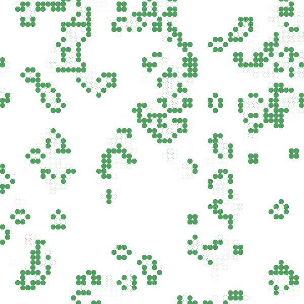

# Conway's Game of Life 🦠

This project implements [Conway's Game of Life](https://en.wikipedia.org/wiki/Conway%27s_Game_of_Life) as a single-page JavaScript application.

## Implementation

This implementation of Conway's Game of Life uses the [Canvas API](https://developer.mozilla.org/en-US/docs/Web/API/Canvas_API) to draw cells.

The underlying grid is a toroidal array, such that the left and right edges and top and bottom edges are stitched together.

## Instructions

To launch the application run `npm start`.

Once the application is running navigate to `http://localhost:1234` to view the page.

Life typically converges to a stable state after a number of generations. Refreshing the page will yield a new randomized seed to start the grid anew.

## Observations

Cells appear to leave behind a 'residue' after they die off that fades over the next few generations. I actually like the way that this looks, but I didn't do go out of my way to implement it. Instead this comes as a side effect of pixel anti-aliasing when drawing `arc` paths on the canvas. I do not clear the canvas between generations and merely draw new cell circles over old ones, so anti-aliasing pixels from the previous generation may still be visible.